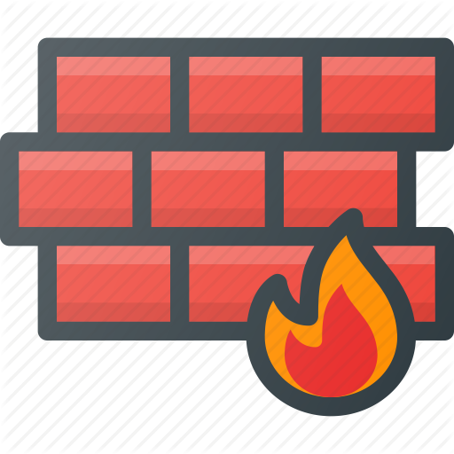

  

    
   

# Flarefree - Firewall as Loadable Kernel Module

Flareoff is a stateful software firewall implemented as a Loadable Kernel Module (LKM). Flareoff provides network security by filtering incoming and outgoing network traffic based on a set of user-defined rules.  

Loadable Kernel Modules are kernel extensions that can be loaded into operating system kernel dynamically.  

## Licensing and Contribution

Flareoff is an open-source software and is licensed under the GNU General Public License v3.0. Anyone interested is free to contribute to the project.
